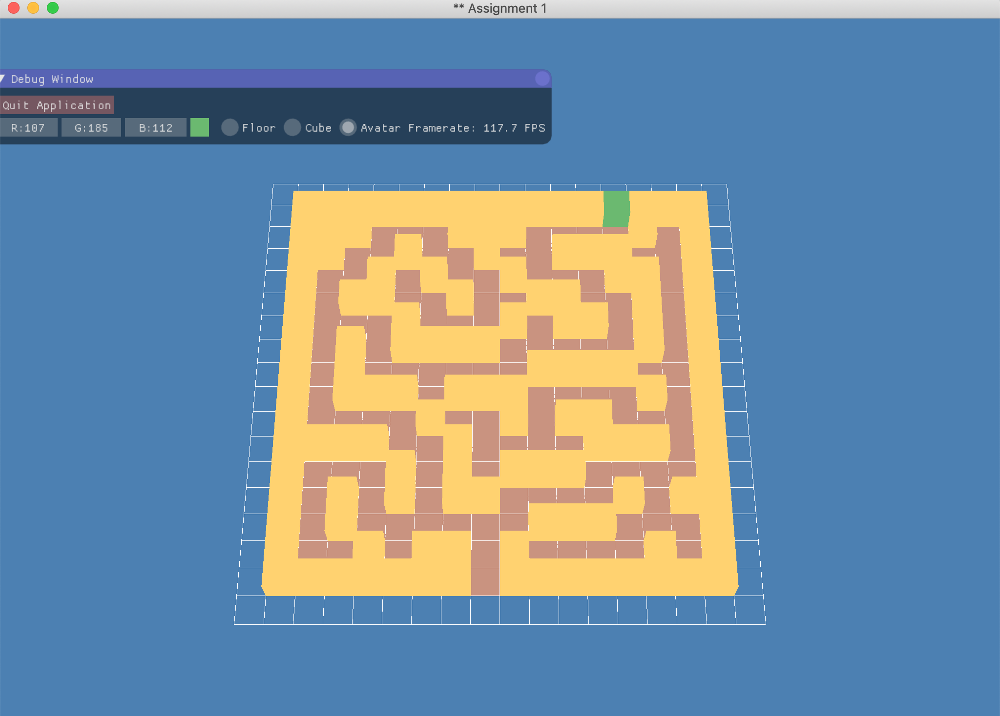

# Maze

---

## Purposes
Designed a maze in OpenGL, defined and allocated an avatar at the entrance of the maze, user could move the avatar around the maze using arrow keys. 

## Guid to use

* press Q to quit 
* press R to reset the maze to initial state
* press D to generate the maze
* Use Arrow keys to go around the maze
* use colour editor in user interface the change the colour of the maze
* drag the mouse to rotate the maze around its centre
* use mouse's scroll wheel to scale the maze

## Interface

